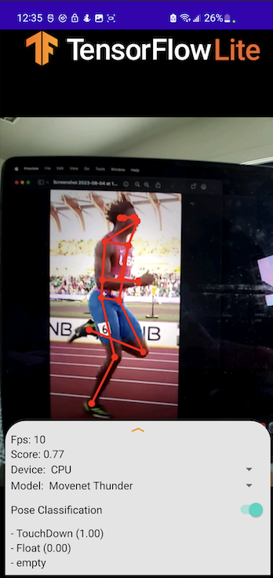
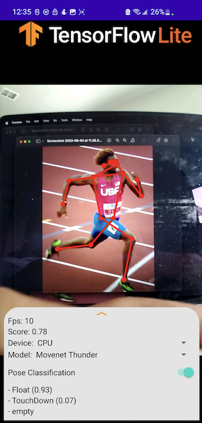

# TensorFlow Lite Pose Estimation Android Demo

### Overview
This is an app that continuously detects the body parts in the frames seen by
your device's camera. Camera captures are discarded immediately after
use, nothing is stored or saved.

The app demonstrates the use of single-pose models:

* The model can estimate the pose of only one person in the
input image. If the input image contains multiple persons, the detection result
can be largely incorrect.
    * MoveNet Thunder is used to train the classification model, so is recommended for in-app use.
* Output of MoveNet Thunder is passed into the classification model to determine which phase of sprinting form the subject is currently in:
    * Float: the moment in which the sprinter's legs are split apart the most, and the sprinter appears to be floating in the air.

    * Touchdown: the moment in which the sprinter has one leg touching the ground

<h2>Example Outputs</h2>

 

<h2>Files that I changed from the original forked repo (https://github.com/qadolphe/Running-Form-Analyzer/tree/master/android) </h2>

* PoseClassifier.kt
* Labels.txt
* Build.gradle
* gradle.properties
* AndroidManifest.xml

### Models used
Downloading, extraction and placement in assets folder has been managed
 automatically by `download.gradle`.

If you explicitly want to download the model, you can download it from here:

* [Posenet](https://storage.googleapis.com/download.tensorflow.org/models/tflite/posenet_mobilenet_v1_100_257x257_multi_kpt_stripped.tflite)
* [Movenet Lightning](https://tfhub.dev/google/movenet/singlepose/lightning/)
* [Movenet Thunder](https://tfhub.dev/google/movenet/singlepose/thunder/)

