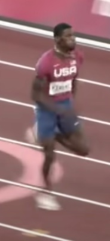

# TensorFlow Lite Pose Estimation Android Demo

### Overview
This is an app that continuously detects the body parts in the frames seen by
your device's camera. Camera captures are discarded immediately after
use, nothing is stored or saved.

The app demonstrates the use of single-pose models:

* The model can estimate the pose of only one person in the
input image. If the input image contains multiple persons, the detection result
can be largely incorrect.
    * MoveNet Thunder is used to train the classification model, so is recommended for in-app use.
* Output of MoveNet Thunder is passed into the classification model to determine which phase of sprinting form the subject is currently in:

<h3>Float: the moment in which the sprinter's legs are split apart the most, and the sprinter appears to be floating in the air.</h3>

 
    
<h3> Touchdown: the moment in which the sprinter has one leg touching the ground</h3>

<h2>Example Outputs</h2>

 

<h2>Files that I changed from the original forked repo (https://github.com/qadolphe/Running-Form-Analyzer/tree/master/android) </h2>

* PoseClassifier.kt
* Labels.txt
* Build.gradle
* gradle.properties
* AndroidManifest.xml

### Models used
Downloading, extraction and placement in assets folder has been managed
 automatically by `download.gradle`.

If you explicitly want to download the model, you can download it from here:

* [Posenet](https://storage.googleapis.com/download.tensorflow.org/models/tflite/posenet_mobilenet_v1_100_257x257_multi_kpt_stripped.tflite)
* [Movenet Lightning](https://tfhub.dev/google/movenet/singlepose/lightning/)
* [Movenet Thunder](https://tfhub.dev/google/movenet/singlepose/thunder/)

# Build the demo using Android Studio

### Prerequisites

* If you don't have it already, install **[Android Studio](
 https://developer.android.com/studio/index.html)** 4.2 or
 above, following the instructions on the website.

* Android device and Android development environment with minimum API 21.

### Building
* Open Android Studio, and from the `Welcome` screen, select
`Open an existing Android Studio project`.

* From the `Open File or Project` window that appears, navigate to and select
 the `lite/examples/pose_estimation/android` directory from wherever you
 cloned the `tensorflow/examples` GitHub repo. Click `OK`.

* If it asks you to do a `Gradle Sync`, click `OK`.

* You may also need to install various platforms and tools, if you get errors
 like `Failed to find target with hash string 'android-21'` and similar. Click
 the `Run` button (the green arrow) or select `Run` > `Run 'android'` from the
 top menu. You may need to rebuild the project using `Build` > `Rebuild Project`.

* If it asks you to use `Instant Run`, click `Proceed Without Instant Run`.

* Also, you need to have an Android device plugged in with developer options
 enabled at this point. See **[here](
 https://developer.android.com/studio/run/device)** for more details
 on setting up developer devices.

